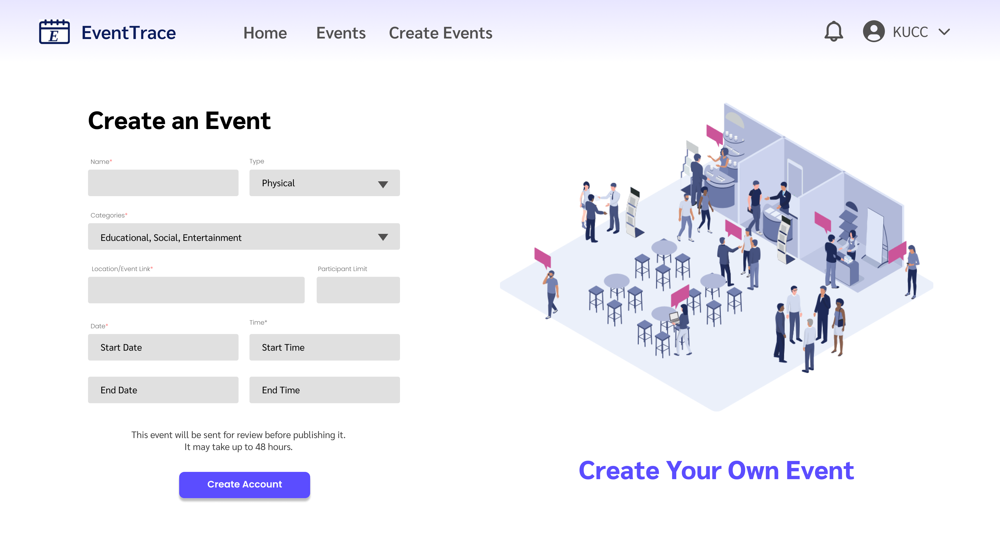
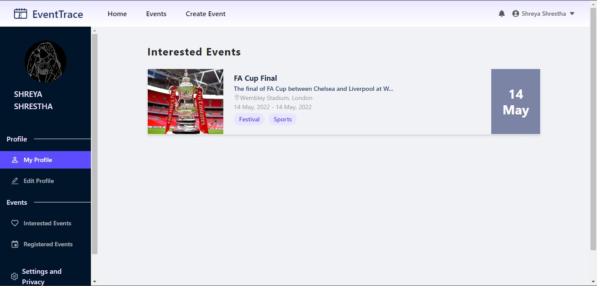

<h1 align="center">
    
</h1>
<h3 align="center">
    <b>EventTrace - Making Event management easy</b>
</h3>


## About 
<h1></h1>

[EventTrace](https://event-trace.vercel.app/home) is the complete Event managament and tracking Web-based Application that brings participants and organiser of the events in a single platfom. It helps user find and register for an event. EventTrace helps the organiser manage and promote the event on the single platform.

## Key Features 🧑‍💻

- Searching and exploring the interested categories of events 
- Registering for an event
- Create, manage and promote event
- View and manage the participants of the events

## Run Locally (Development Environment) ⚒️

#### Clone the repository and navigate to the project root directory. 
Make sure you have [npm and Node.js](https://docs.npmjs.com/downloading-and-installing-node-js-and-npm) installed on your machine.

```bash
# Get packages
$ npm install
```

```bash
# Run the applicaton
$ npm start
```

```bash
# To build apk and ios bundle:
$ npm build
```

## Tech Used 💻

- Frontend : React.js
- Database : Cloud Firestore
- Authentication : Firebase Auth
- File Storage : Cloudinary
- Backend as a Service : Firebase

  
## Screenshots 

<div align="center">
  
  
  
</div>

## Contributions

Contributions are highly appreciated. Please send a Pull Request with suggested changes or open an Issue to get things started!
